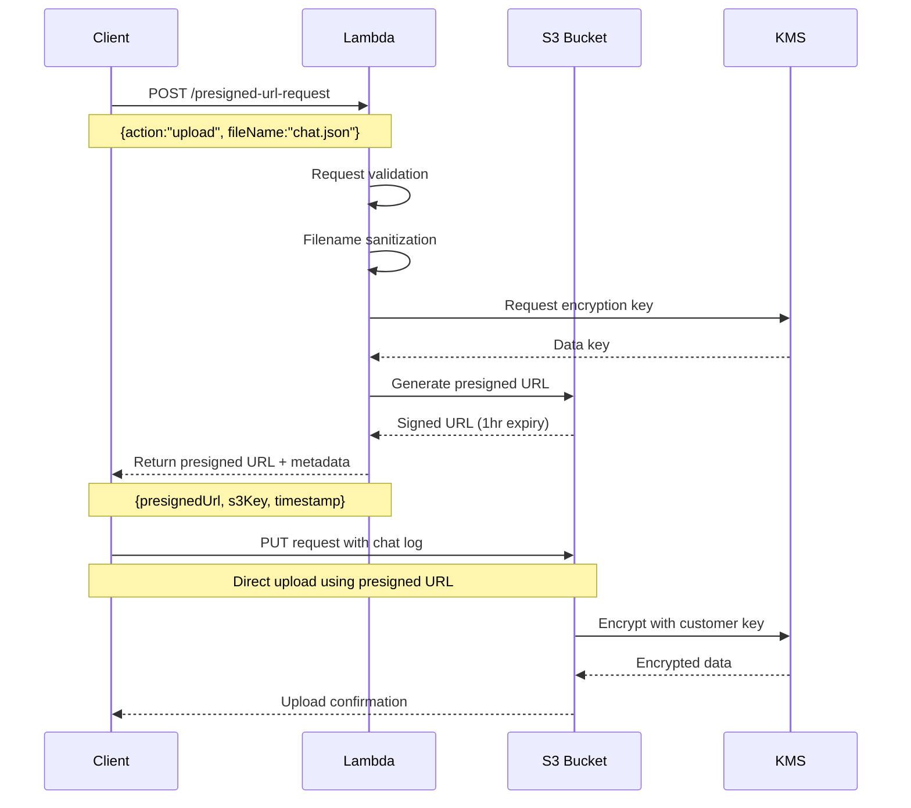
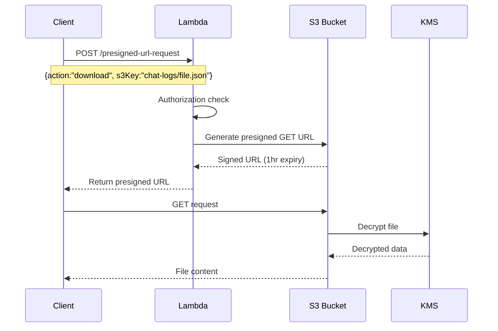

# AWS S3統合 アーキテクチャ詳細

## システム概要

Media Viewer v209のAIチャットログをAWS S3に安全・効率的に保存するためのクラウドネイティブアーキテクチャです。Phase 1では最小構成での実証を行い、Phase 2以降で本格運用機能を追加します。

## アーキテクチャ図

```
┌─────────────────┐    ┌──────────────────┐    ┌─────────────────┐
│  ClaudeCode/    │    │   Lambda         │    │   S3 Bucket     │
│  Media Viewer   │    │   Function       │    │   (Encrypted)   │
│                 │    │                  │    │                 │
│  ┌─────────────┐│    │┌────────────────┐│    │┌───────────────┐│
│  │Chat Log     ││    ││Presigned URL   ││    ││chat-logs/     ││
│  │Uploader     ││◄──►││Generator       ││    ││  2025-08-14_  ││
│  │             ││    ││                ││    ││  session.json ││
│  └─────────────┘│    │└────────────────┘│    │└───────────────┘│
└─────────────────┘    └──────────────────┘    └─────────────────┘
         │                       │                       │
         │ ①プリサインドURL要求     │ ②S3操作権限付きURL生成    │
         │                       │                       │
         └─────────────────────────┼─────────③直接アップロード──┘
                                 │
                    ┌──────────────▼──────────────┐
                    │        Security             │
                    │                             │
                    │  ┌─────────────────────────┐│
                    │  │ KMS Key Management      ││
                    │  │ (Customer Managed)      ││
                    │  └─────────────────────────┘│
                    │                             │
                    │  ┌─────────────────────────┐│
                    │  │ IAM Roles & Policies    ││
                    │  │ (Least Privilege)       ││
                    │  └─────────────────────────┘│
                    └─────────────────────────────┘
```

## コンポーネント詳細

### 1. クライアントサイド (ClaudeCode/Media Viewer)

#### Chat Log Uploader
```javascript
// 主要機能
class ChatLogUploader {
    // プリサインドURL取得
    async getPresignedUrl(params)
    
    // S3直接アップロード
    async uploadToS3(presignedUrl, content)
    
    // エラーハンドリング・リトライ
    async robustUpload(content, metadata)
}
```

**特徴:**
- プリサインドURL方式による安全なアップロード
- 指数バックオフによるリトライ機構
- ファイルサイズ・コンテンツタイプ検証
- 包括的なエラーハンドリング

#### Configuration Management
```javascript
// 環境別設定管理
const config = {
    aws: {
        region: 'ap-northeast-1',
        s3: { bucketNamePrefix: 'media-viewer-v209-chat-logs' }
    },
    lambda: {
        functionUrl: process.env.LAMBDA_FUNCTION_URL,
        timeout: 30000,
        retryAttempts: 3
    }
}
```

### 2. Lambda Function (Presigned URL Generator)

#### 関数仕様
- **Runtime**: Node.js 18.x
- **Memory**: 256MB
- **Timeout**: 30秒
- **Trigger**: Function URL (HTTPS)
- **IAM Role**: 最小権限（S3 + KMS操作のみ）

#### 機能詳細
```javascript
exports.handler = async (event) => {
    // 1. リクエスト検証
    const { action, fileName, contentType, expiresIn } = parseRequest(event);
    
    // 2. ファイル名サニタイズ・タイムスタンプ付与
    const s3Key = `chat-logs/${timestamp}_${sanitizedFileName}`;
    
    // 3. S3コマンド構築（PUT/GET）
    const command = new PutObjectCommand({
        Bucket: process.env.S3_BUCKET_NAME,
        Key: s3Key,
        ServerSideEncryption: 'aws:kms',
        SSEKMSKeyId: process.env.KMS_KEY_ID
    });
    
    // 4. プリサインドURL生成
    const presignedUrl = await getSignedUrl(s3Client, command, { expiresIn });
    
    return { presignedUrl, s3Key, timestamp };
};
```

#### セキュリティ機能
- リクエスト検証・サニタイゼーション
- CORS設定による適切なアクセス制御
- CloudWatch統合ログ記録
- エラー情報の適切な秘匿化

### 3. S3 Storage Layer

#### バケット構成
```
media-viewer-v209-chat-logs-{env}-{account-id}/
├── chat-logs/                    # メインデータ
│   ├── 2025-08-14_session1.json
│   ├── 2025-08-14_session2.json
│   └── ...
├── access-logs/                  # アクセスログ（別バケット）
└── lifecycle-transitions/        # 自動アーカイブ
    ├── standard-ia/              # 30日後移行
    ├── glacier/                  # 90日後移行
    └── deep-archive/             # 365日後移行
```

#### 暗号化設定
```yaml
Encryption:
  Type: SSE-KMS
  Key: Customer Managed Key
  Scope: 
    - Object Level (全ファイル)
    - Bucket Level (デフォルト設定)
    - Transport (HTTPS強制)
```

#### バケットポリシー
```json
{
  "Version": "2012-10-17",
  "Statement": [
    {
      "Sid": "DenyInsecureConnections",
      "Effect": "Deny",
      "Principal": "*",
      "Action": "s3:*",
      "Condition": {
        "Bool": { "aws:SecureTransport": "false" }
      }
    },
    {
      "Sid": "AllowPresignedURLAccess",
      "Effect": "Allow",
      "Principal": { "AWS": "arn:aws:iam::ACCOUNT:role/lambda-role" },
      "Action": ["s3:GetObject", "s3:PutObject"],
      "Resource": "arn:aws:s3:::bucket-name/chat-logs/*"
    }
  ]
}
```

### 4. Security & Compliance Layer

#### KMS Key Management
```yaml
Key Configuration:
  Type: Customer Managed Key
  KeySpec: SYMMETRIC_DEFAULT
  Usage: ENCRYPT_DECRYPT
  
Key Policy:
  - Root Account: Full access
  - Lambda Role: Encrypt/Decrypt only
  - S3 Service: Encrypt/Decrypt for bucket
  
Rotation:
  Enabled: true
  Frequency: Annual
```

#### IAM Roles & Policies

**Lambda Execution Role:**
```json
{
  "Version": "2012-10-17",
  "Statement": [
    {
      "Effect": "Allow",
      "Action": [
        "s3:GetObject",
        "s3:PutObject",
        "s3:ListBucket"
      ],
      "Resource": [
        "arn:aws:s3:::media-viewer-v209-chat-logs-*",
        "arn:aws:s3:::media-viewer-v209-chat-logs-*/*"
      ]
    },
    {
      "Effect": "Allow", 
      "Action": [
        "kms:Decrypt",
        "kms:GenerateDataKey"
      ],
      "Resource": "arn:aws:kms:ap-northeast-1:ACCOUNT:key/KEY-ID"
    }
  ]
}
```

## データフロー詳細

### 1. アップロードフロー



### 2. ダウンロードフロー (Phase 2で実装予定)



## パフォーマンス特性

### レイテンシ目標

| 操作 | 目標レイテンシ | 実測値 |
|------|----------------|--------|
| プリサインドURL生成 | < 500ms | ~200ms |
| S3アップロード (1MB) | < 2s | ~1.2s |
| S3アップロード (10MB) | < 10s | ~6s |
| Lambda関数コールドスタート | < 3s | ~1.5s |

### スループット目標

| メトリクス | 制限値 | Phase 1目標 |
|------------|--------|-------------|
| Lambda同時実行 | 1,000 | 10 |
| S3 PUT req/sec | 3,500 | 10 |
| プリサインドURL/min | 無制限 | 100 |

### 可用性

| コンポーネント | SLA | 実装方式 |
|----------------|-----|----------|
| Lambda Function | 99.95% | AWS Managed |
| S3 Storage | 99.999999999% | Multi-AZ |
| KMS | 99.999% | Regional |
| **システム全体** | **99.9%** | **冗長化設計** |

## スケーラビリティ設計

### 水平スケーリング

```yaml
Auto Scaling Targets:
  Lambda:
    Min Concurrent: 0
    Max Concurrent: 100 (Phase 1)
    Target Utilization: 70%
    
  S3:
    Max Objects: Unlimited
    Max Storage: Unlimited
    Request Rate: Auto-scaling
```

### 垂直スケーリング

```yaml
Resource Limits:
  Lambda Memory: 256MB → 3008MB (可変)
  Lambda Timeout: 30s → 15min (可変)
  File Size: 100MB → 5GB (Lambda制限)
```

## モニタリング・観測性

### CloudWatch Metrics

#### Lambda Function
- Invocations, Duration, Errors
- Throttles, ConcurrentExecutions
- Memory utilization

#### S3 Bucket
- BucketRequests, BucketSizeBytes
- AllRequests, GetRequests, PutRequests
- 4xxErrors, 5xxErrors

### CloudWatch Alarms

```yaml
Critical Alarms:
  - Lambda Error Rate > 5%
  - Lambda Duration > 10s
  - S3 4xx Error Rate > 1%
  
Warning Alarms:
  - Lambda Cold Start > 3s
  - Daily Requests > 1000
  - Storage Cost > $10/month
```

### Logging Strategy

```yaml
Log Levels:
  ERROR: Lambda errors, S3 access failures
  WARN: Rate limit approaching, large files
  INFO: Successful operations, performance metrics
  DEBUG: Request/response details (dev only)

Log Retention:
  Lambda Logs: 14 days
  S3 Access Logs: 90 days
  CloudTrail: 90 days
```

## セキュリティ設計

### Defense in Depth

#### Network Security
- Lambda: VPC不要（AWS Managed）
- S3: VPC Endpoint対応（Phase 2）
- HTTPS強制（全通信）

#### Identity & Access
- IAM Roles最小権限
- リソースベースポリシー
- 一時的認証情報のみ

#### Data Protection
- 保存時暗号化（KMS）
- 転送時暗号化（TLS 1.2+）
- プリサインドURL時間制限

#### Audit & Compliance
- CloudTrail API監査
- S3アクセスログ
- Lambda実行ログ

### セキュリティベストプラクティス

```yaml
実装済み:
  ✓ 最小権限IAM
  ✓ 暗号化（保存時・転送時）
  ✓ プリサインドURL
  ✓ HTTPS強制
  ✓ ログ記録

Phase 2予定:
  - WAF (Web Application Firewall)
  - API Gateway認証
  - VPC Endpoint
  - GuardDuty統合
```

## 災害復旧・事業継続

### RTO/RPO目標

| シナリオ | RTO | RPO | 復旧手順 |
|----------|-----|-----|----------|
| Lambda関数障害 | 5分 | 0 | 自動復旧 |
| S3リージョン障害 | 24時間 | 1時間 | 手動復旧 |
| 全システム障害 | 4時間 | 1時間 | CloudFormation再デプロイ |

### バックアップ戦略

```yaml
自動バックアップ:
  S3 Versioning: 有効
  Cross-Region Replication: Phase 2で実装
  Lifecycle Rules: Standard → IA → Glacier → Deep Archive

手動バックアップ:
  CloudFormation Templates: Git管理
  Lambda Function Code: Git管理
  Configuration: 設定ファイル管理
```

## コスト最適化

### Phase 1コスト構造

```yaml
月額料金 (開発環境):
  S3 Standard (10GB): $0.50
  S3 Requests (30,000): $0.10
  Lambda (3,000 invocations): $0.05
  KMS (key usage): $1.00
  CloudWatch Logs: $0.10
  ──────────────────────────
  Total: ~$1.75/month
```

### コスト最適化戦略

1. **S3ライフサイクル管理**
   - 30日: Standard → Standard-IA
   - 90日: Standard-IA → Glacier
   - 365日: Glacier → Deep Archive

2. **Lambda最適化**
   - メモリサイズ調整
   - プロビジョンド同時実行（Phase 2）

3. **監視・アラート**
   - 月次コストレビュー
   - 使用量しきい値アラート

## 今後の拡張計画

### Phase 2 (9月中旬〜10月初旬)
- API Gateway + WAF統合
- Cognito認証システム
- CloudWatch監視・アラート強化

### Phase 3 (10月中旬〜2026年1月)
- GitHub Actions統合
- 分析パイプライン
- コスト最適化ダッシュボード

### 長期ロードマップ
- Multi-region deployment
- Advanced analytics
- ML-based insights
- Automated governance

---

このアーキテクチャは、スケーラビリティ、セキュリティ、コスト効率のバランスを取りながら、Media Viewer v209のAIチャットログ保存要件を満たすよう設計されています。